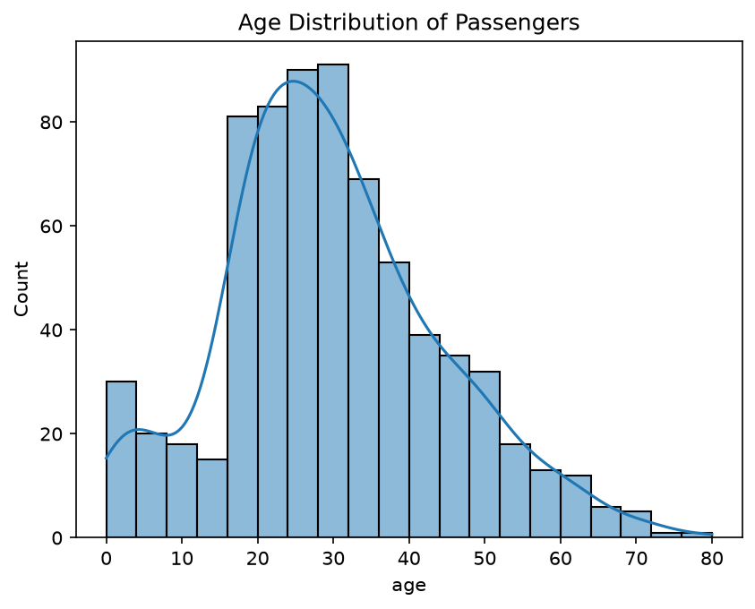
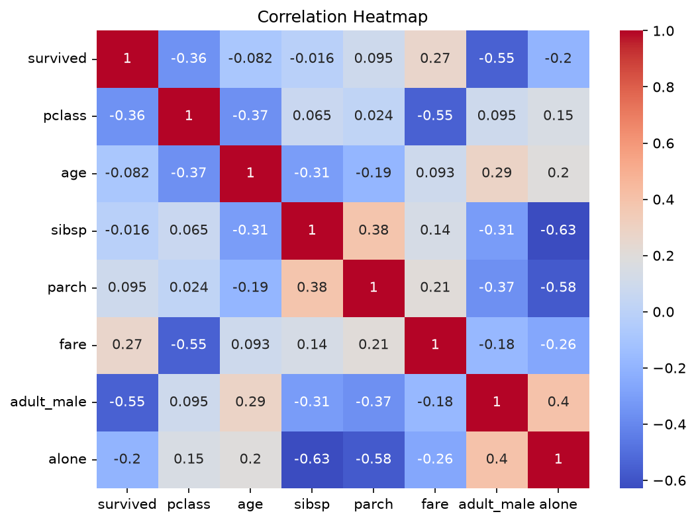
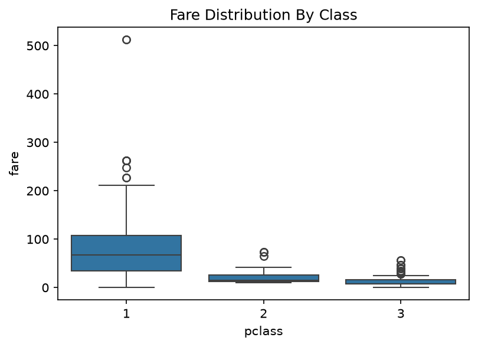

# Sale EDA Dashboard/ Titanic EDA project

**Problem** : Explore what factors affcting survival on the Titanic.
**Dataset**: 891 passengers, 15 features from Seaborn.

**Key insights**:

**Gender was the biggest factor**: 74% of females survived vs 19% of male.
**Passenger class mattered**: 1st classpaid ~3x more fare than 3rd class.
**Most passengers were young adults**, age 20-40.

**Visual:**

**How to Run**:
'''bash
pip install pandas seaborn matplpotlib
python Sale_EDA_Dashboard.py
